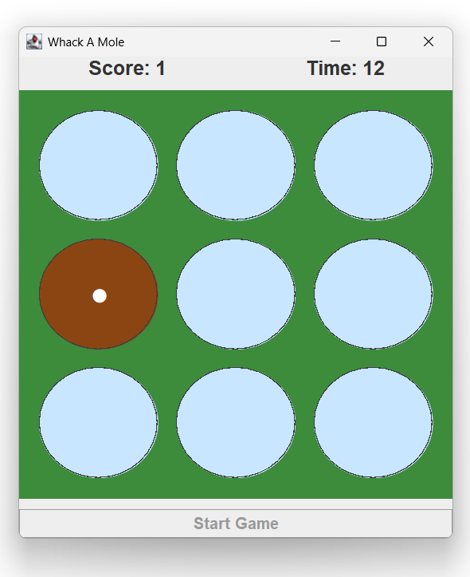
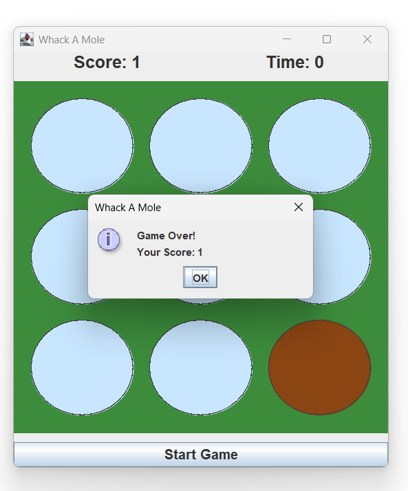

## Whack-A-Mole (Java Swing)
I built this small Whack-A-Mole game using Java Swing to get more comfortable with GUI development and event handling in Java.
The game is simple — a mole randomly appears in a 3x3 grid, and you have to click it as quickly as possible to score points before the timer runs out. It helped me understand how real-time updates and user interactions work in a desktop application.

### Features
- 3x3 interactive grid  
- 30-second countdown timer  
- Live score updates  
- Random mole appearance  
- Custom circular buttons to make it look more like actual “holes”  

### Tech Stack
- Java  
- Swing & AWT  

### How to Run
1. Compile the program:
   javac WhackAMole.java
2. Run it:
   java WhackAMole

### What I Learned
- Working with Java Swing components and layouts  
- Handling user actions using ActionListener  
- Using Timer for animations and countdown logic  
- Basic custom UI design using Graphics  

### Future Improvements
- Add sound effects  
- Introduce difficulty levels  
- Track high scores  
- Improve overall UI

### Preview

  
  

